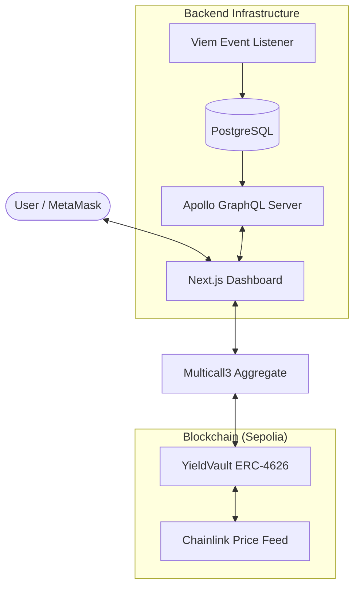

# 🚀 DeFi Yield Vault & Real-Time Indexer

A professional-grade DeFi portfolio demonstrating a full-stack Web3 architecture — from **ERC-4626 standard** smart contracts to a real-time GraphQL indexer and a glassmorphism dashboard.


> **Live Demo:** [https://yield-cosmos.vercel.app](https://yield-cosmos.vercel.app)  
> **Sepolia Contract:** [0x...](https://sepolia.etherscan.io/address/0x...)

---

## 🏗 High-Level Architecture



---

## 💎 Senior Engineer Notes: Design Patterns & Decisions

### 1. ERC-4626 Tokenized Vaults
We implemented the **ERC-4626** standard instead of a custom vault logic. 
- **Why?** It's the gold standard for yield-bearing tokens. By adhering to it, this vault is natively compatible with the entire DeFi ecosystem (Yearn, Aave, Curve) without needing custom adapters.

### 2. Chainlink Price Oracles
The project integrates `AggregatorV3Interface` to fetch real-time USD valuations.
- **Why?** Handling asset valuation *on-chain* securely is a critical senior skill. This prevents price manipulation and ensures the "Total Value Locked" displayed is accurate and decentralized.

### 3. Wagmi Multicall Optimization
The frontend uses `useReadContracts` to batch 5+ simultaneous contract calls into a **single RPC request**.
- **Why?** Professional dApps must be performant. Multicall reduces network latency, prevents UI flickering, and significantly lowers the load on RPC providers like Alchemy or Infura.

### 4. Real-Time Indexing vs. Direct RPC
We built a custom indexer using **Viem + Prisma + PostgreSQL**.
- **Why?** Querying historical events directly from an RPC is slow and expensive. Our indexer provides a decoupled GraphQL API that allows for complex filtering, sorting, and lightning-fast dashboard updates.

---

## ✅ Technical Specifications

| Layer | Technology | Highlights |
|-------|------------|------------|
| **Smart Contract** | Solidity 0.8.24, Hardhat | ERC-4626, Chainlink, 100% Test Coverage |
| **Indexer** | Node.js, Viem, Prisma | Real-time event syncing to PostgreSQL |
| **API Layer** | Apollo Server 4, GraphQL | Decoupled and type-safe data access |
| **Frontend** | Next.js 14, Wagmi, Tailwind | Glassmorphism UI, Multicall optimization |
| **Security** | OpenZeppelin, ReentrancyGuard | Protection against standard attack vectors |

---

## 🚀 Local Development

### 1. Installation
```bash
pnpm install
```

### 2. Start Full Stack
```bash
# Starts Node, Listener, Server, and Frontend concurrently
pnpm dev
```

### 3. Deploy Local Contracts
```bash
pnpm deploy
```

---

## 🧪 Security & Testing
We prioritize safety. The core vault has **100% test coverage**, including reentrancy attack simulations.

```bash
pnpm --filter @portfolio/contracts coverage
```

---

Developed by **Sandro Dezerio** — Web3 Engineering Portfolio
